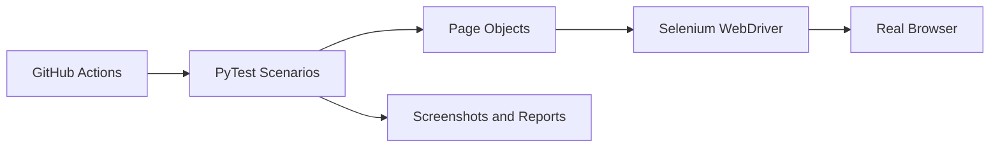
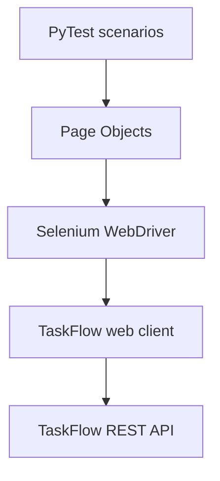

# Selenium Web Automation Framework

[](https://github.com/PhilipOkeke/selenium-web-automation-framework/actions/workflows/ci.yml)
[](https://www.selenium.dev/)
[](https://www.python.org/)

An end-to-end browser automation framework built with Selenium WebDriver, Python, and PyTest. It tests a responsive TaskFlow web client connected to the [TaskFlow REST API](https://github.com/PhilipOkeke/taskflow-backend-api).


## Architecture



This project demonstrates **QA automation** and **software development** together: Page Object Model architecture, explicit waits, browser fixtures, test-data control, failure screenshots, HTML/JUnit reports, CI, and a working JavaScript user interface.

## Automated user journeys

- Load the dashboard and verify API connectivity
- Validate required form fields
- Create high-priority tasks
- Move tasks through workflow statuses
- Delete tasks through browser confirmation dialogs
- Combine status and priority filters
- Search for matching work items
- Clean test data before and after each scenario

## Technology

| Area | Tools |
|---|---|
| Browser automation | Selenium WebDriver |
| Test runner | PyTest |
| Framework pattern | Page Object Model |
| Test setup and cleanup | Requests + PyTest fixtures |
| Reports | pytest-html and JUnit XML |
| Failure evidence | Automatic PNG screenshots |
| Web client | HTML5, CSS3, JavaScript |
| Continuous integration | GitHub Actions + headless Chrome |

## Architecture



The tests describe user behavior. Page Objects own locators and browser actions, while fixtures own browsers, API setup, cleanup, and failure evidence. This keeps test cases readable and reduces duplicated UI logic.

## Repository relationship

This is the browser-testing layer of a three-repository portfolio:

1. [`taskflow-backend-api`](https://github.com/PhilipOkeke/taskflow-backend-api) — backend REST API development.
2. [`api-testing-framework`](https://github.com/PhilipOkeke/api-testing-framework) — black-box API automation.
3. `selenium-web-automation-framework` — web client and browser automation.

## Run locally

### 1. Start TaskFlow API

In the `taskflow-api` repository:

```bash
python -m venv .venv
```

Activate the environment on Windows:

```powershell
.venv\Scripts\Activate.ps1
```

Install and start the API:

```bash
pip install -e ".[dev]"
uvicorn app.main:app --reload
```

### 2. Start the web client

Open a second terminal in this repository:

```bash
python -m venv .venv
```

Activate it on Windows and install the project:

```powershell
.venv\Scripts\Activate.ps1
pip install -e ".[dev]"
python scripts/serve_web_app.py
```

Open `http://127.0.0.1:3000` to use the dashboard.

### 3. Run browser tests

Open a third terminal in this repository, activate the same environment, and run:

```bash
pytest
```

Selenium Manager handles the matching browser driver automatically. The default run uses headless Chrome. To watch Chrome while tests run:

```powershell
$env:HEADLESS = "false"
pytest
```

To run Firefox instead:

```powershell
$env:BROWSER = "firefox"
pytest
```

## Select suites and generate reports

```bash
pytest -m smoke
pytest -m regression
pytest --html=reports/selenium-report.html --self-contained-html --junitxml=reports/junit.xml
```

When a test fails, the PyTest hook saves a screenshot under `screenshots/`. GitHub Actions preserves screenshots, test reports, and service logs as downloadable artifacts.

## Project structure

```text
selenium-web-automation-framework/
├── .github/workflows/ci.yml
├── scripts/
│   ├── serve_web_app.py
│   └── wait_for_services.py
├── src/taskflow_web_automation/
│   ├── pages/
│   │   ├── base_page.py
│   │   └── taskflow_page.py
│   ├── config.py
│   └── driver_factory.py
├── tests/
│   ├── conftest.py
│   ├── test_dashboard.py
│   ├── test_task_discovery.py
│   └── test_task_lifecycle.py
├── web_app/
│   ├── app.js
│   ├── index.html
│   └── style.css
├── .env.example
├── LICENSE
└── pyproject.toml
```

## Author

**Philip Okeke**  
Software Engineer | Backend Developer | QA Automation Engineer

- Email: [Engr.philipokeke@gmail.com](mailto:Engr.philipokeke@gmail.com)
- LinkedIn: [linkedin.com/in/philip-okeke-8148a42a4](https://www.linkedin.com/in/philip-okeke-8148a42a4)
- GitHub: [github.com/PhilipOkeke](https://github.com/PhilipOkeke)
